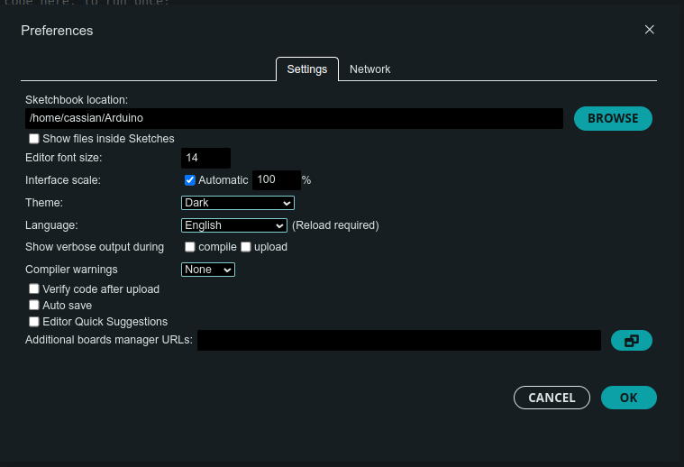

# Getting Started

This tutorial covers how to get started developing for the ESP-32 using the Arduino IDE. These instructions will cover installing Arduino IDE on Windows, Mac, or Linux, installing any needed drivers, as well the add-on for Arduino to use our ESP-32 microcontrollers.

## Installing Arduino IDE

We'll start by installing the [Arduino IDE 2.0](https://www.arduino.cc/en/Tutorial/getting-started-with-ide-v2).

You can [download the IDE from the Arduino website](https://www.arduino.cc/en/software) for your operating system.


- **Windows**: Download the version for Win 10 and newer, and run the executable.
- **Linux**: Download the AppImage, and run the executable.
> On Fedora Linux 39, Zack had issues with the AppImage. The [IDEv2 flatpak package](https://flathub.org/apps/cc.arduino.IDE2) worked first try.
> 
> On Ubuntu 22.04 LTS, Cassian had no issues with the AppImage.
- **macOS**: Download the Apple Silicon version for newer Macs, and the Intel version for older Macs. Open the downloaded disk image, and copy the Arduino IDE to your application folder.

If you run into issues, you can find more information in the [Arduino Docs](https://docs.arduino.cc/software/ide-v2/tutorials/getting-started/ide-v2-downloading-and-installing/).

## Adding ESP-32 Devices into the Board Manager

The next step is adding ESP-32s to the list of devices Arduino IDE can install to.

1. In your Arduino IDE, choose **File > Preferences**.

2. Copy and paste the following URL into the Additional Board manager URLs textbox.

```
https://raw.githubusercontent.com/espressif/arduino-esp32/gh-pages/package_esp32_index.json
```



3. Open the Boards Manager by clicking the Boards Manager icon on the sidebar - the icon below the folder icon.


4. Search for ESP32, and press the install button for the esp32 by ExpressIf Systems.

## Installing the Drivers (Windows)

This section is only needed when installing Arduino on Windows 10 and Windows 11.

On Windows, Arduino needs an additional driver to write to ESP-32 devices. You can [download the driver from Silicon Labs' website](https://www.silabs.com/documents/public/software/CP210x_Windows_Drivers.zip).

1. Open the ZIP file, and from there choose to extract the file.


2. Launch **CP210xVCPInstaller_x64.exe** and follow the installation wizard.


## Installing pyserial and Updating Permissions (Linux)

This section is only needed when installing Arduino on Linux desktops like Ubuntu.

1. Install pyserial using pip. If you don't have pip installed, you can install Python from your package manager.

```bash
sudo apt install python3
```

```bash 
pip install pyserial
```

2. By default, Arduino is not allowed to write to the serial port. You can change that with the following command.

```bash 
sudo chmod 666 /dev/ttyUSB0
```

## Testing the Installation

Plug the ESP-32 board into your computer, and follow these steps in the Arduino IDE.

1. Click the Select Board dropdown. If you see a board show up, you're on the right track! Click the Unknown board.


2. You'll then be brought to the Other Boards menu. Search for **devkit** and click on the **DOIT ESP32 DEVKIT V1**.


3. Copy and paste the following code into the IDE to test the Internal Blink demo.

```cpp
int pin = 2;

void setup() {
  pinMode(pin, OUTPUT);
}

bool state = HIGH;

void loop() {
  digitalWrite(pin, state);
  state = !state;
  delay(1000);
}
```

4. Press the **Upload** button in the top left corner. Your code will begin to compile.


5. When you see dots begin to move across the screen in the bottom terminal, press and hold the button to the right of the Micro-USB power connector to accept the new code.

6. Once you see the text "Hard resetting..." in the bottom of the terminal, you should be done uploading and can release the button.

7. Press the button to the left of the Micro-USB power connector to reset the ESP-32 and run your new code.

If all went according to plan, your ESP-32 is now flashing its blue LED.

## More Info

If all went well, you're ready to go developing ESP-32 projects with the Norse IoT club! We have various projects in our Wiki, and you can look around on the internet to find additional project ideas.
