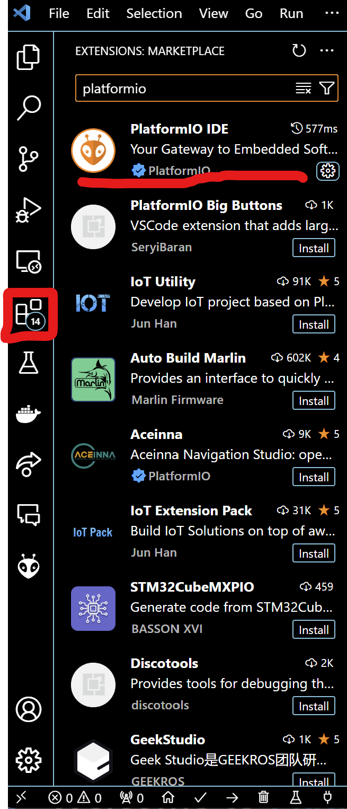
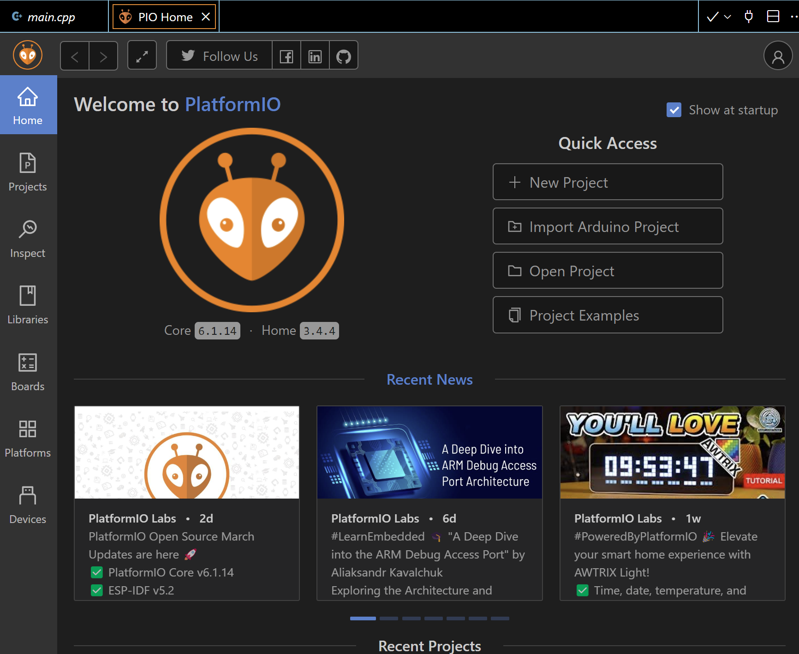
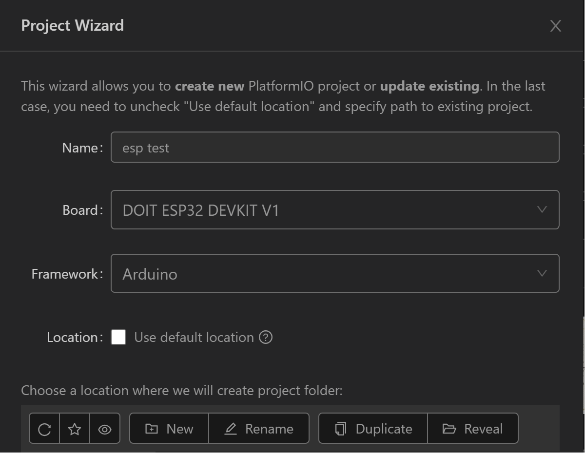
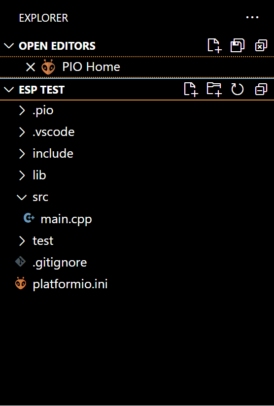
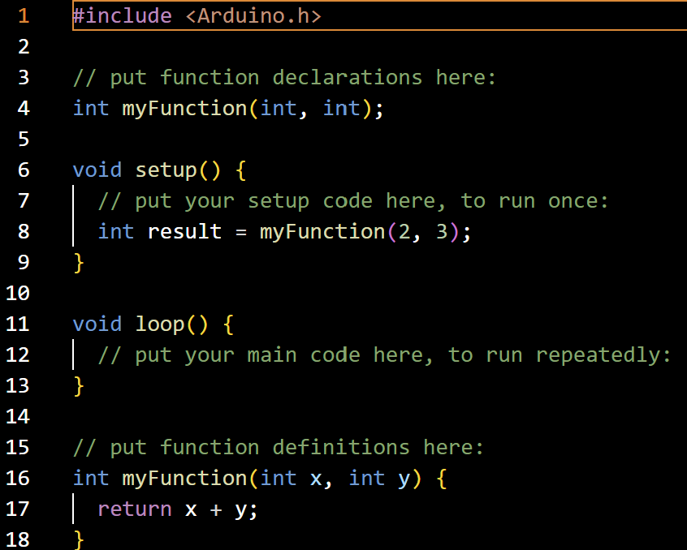

# An Arduino IDE Alternative - PlatformIO

For Those Having Trouble Compiling Multiple Different Projects, PlatformIO is an alternative.

While Arduino IDE is what most people end up using for development of IOT projects, some users with multiple projects may find it difficult to compile and run every project separately on their computer because of Arduino IDE's bad dependency management. It does not have unique dependencies based on individual projects.

Many developers use VSCode regularly anyway, and VSCode has an extension that offers an alternative to Arduino IDE: PlatformIO. PlatformIO has native support for the ESP-IDF frameworks, which is what we mainly use in the club through the ESP32 and ESP8266 boards.

The rest of this resource assumes you have VSCode installed. If you don't, please check out [the Download Page](https://code.visualstudio.com/download). 

### Install PlatformIO

To install PlatformIO, first navigate to the "extensions" tab on the left of the screen with VSCode open and search "PlatformIO". The "PlatformIO IDE" extension should be the first result. Click install. This might take a while. After installed, you will probably need to restart VSCode.

Once installed, there should be a small PlatformIO icon on the left side of your VSCode (it looks like an alien). Click on it, and then under "Quick Acccess"->"PIO Home" click on "Open". This will open the PIO Home tab in your editor, where you can create, delete, and manage projects using IOT. The PIO Home tab will look like this:

### Install the Libraries for your boards

Once you have PlatformIO installed, you should first decide what type of board you want to program on, and you can start this process by going to the "Boards" tab on the left of the PlatformIO home page. In Norse IOT we use the ESP8266

### Create a new PlatformIO project

It is generally unadvised to import projects from the Arduino IDE as they are prone to error and unlikely to follow the standardized format that every PlatformIO project normally has. Instead, it is preferred to always choose "New Project" even when migrating code previously developed on the Arduino IDE.

From here, the project wizard will show up. Depending on the board you are using this step might be different, but you can always change this later in project settings. Select a Project name and the board that is going to be programmed on, we usually use `DOIT ESP32 DEVKIT V1`. Leave the Framework as Arduino. By default, PlatformIO will try to put this project in a default location, but you should probably choose to put it somewhere that is convenient for you.

After you have configured the setup, click on "Finish" and it should create the project for you. you can navigate to the project folder using File->Open Folder, which should look something like this:

### Important Information About Every PlatformIO project

A few directories and files will be automatically created, including a `platformio.ini` file. This file contains the configurations for your PlatformIO project, and every project will have one. Inside the project directory, there are 3 main other directories we should know about: `src` and `lib`. The `src` folder will hold all of the Arduino files that you write. Additionally, PlatformIO uses `.cpp` files instead of `.ino` files. With this change, it becomes necessary to add the line `#include <Arduino.h>` to your code. The `lib` folder will hold every dependency your project has that is not already included in the Arduino suite of built in libraries (as well as every dependency that any other dependency relies on).

There should already be a `main.cpp` file in the `src` folder, and it should look familiar if you've written Arduino code before, with the `setup` and `loop` functions already declared. Notice the added `#include <Arduino.h>`:

From here, development of code should be relatively straightforward, but each specific project will need its own project settings.

### Change Project Settings

Dependencies for your project can be configured from the PlatformIO home page. Most libraries for basically any functionality you need on ESP32 are available through the PlatformIO library manager/search functionality, which you can find in the "Libraries" tab on the left.

